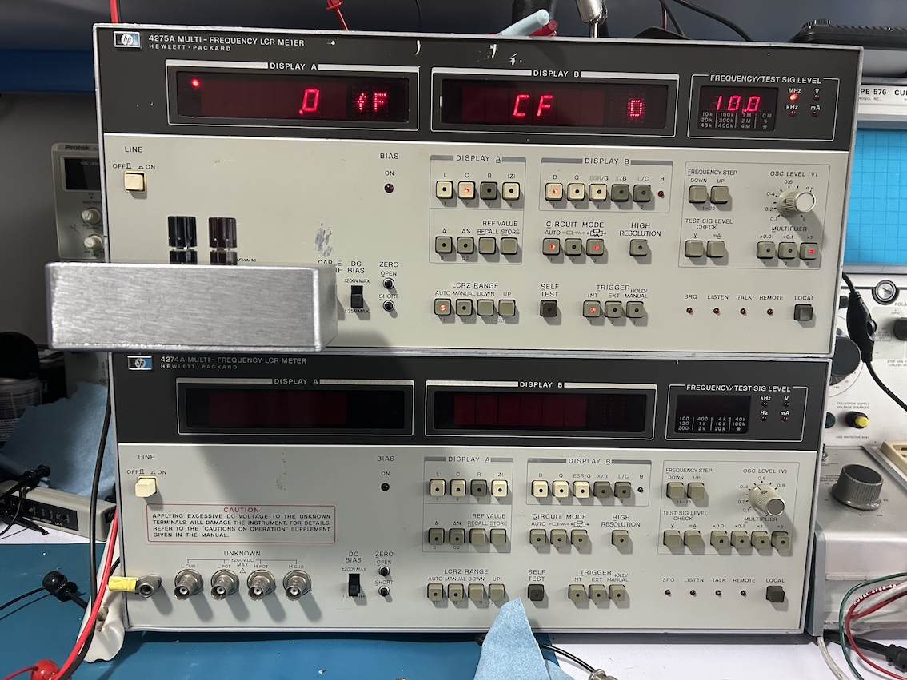
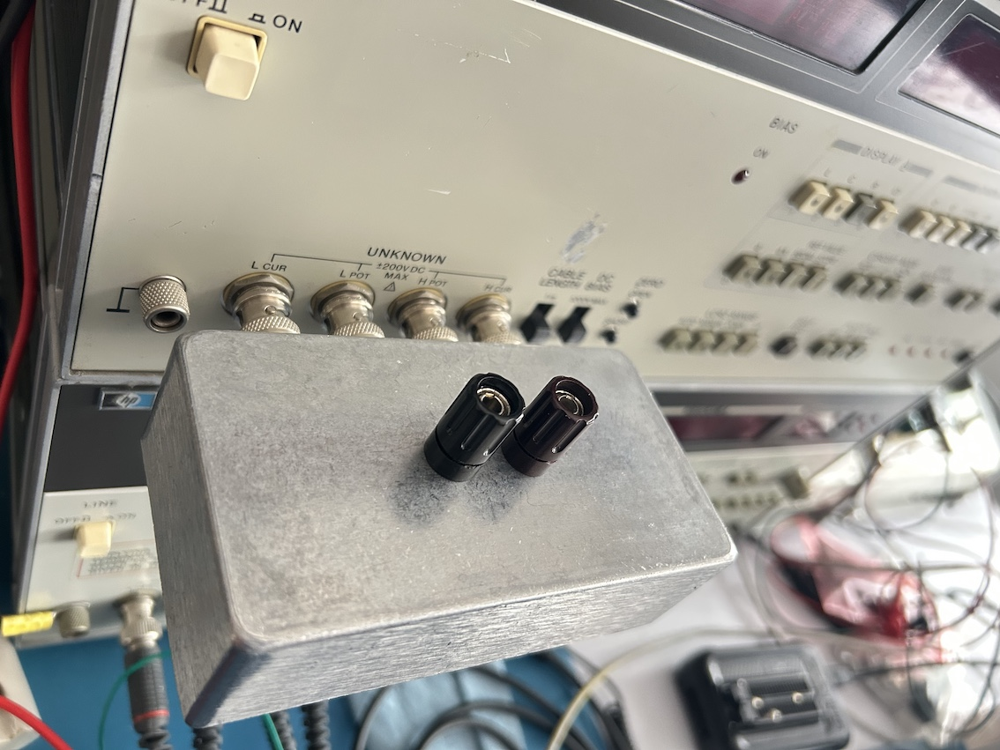
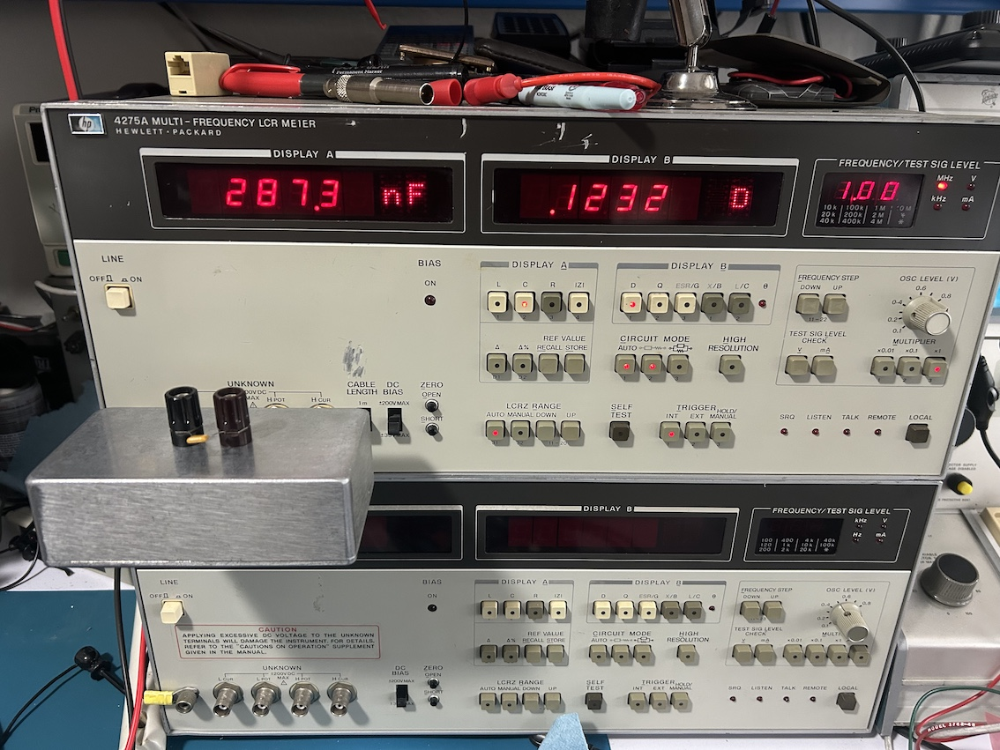
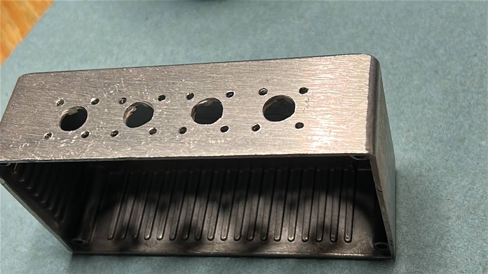
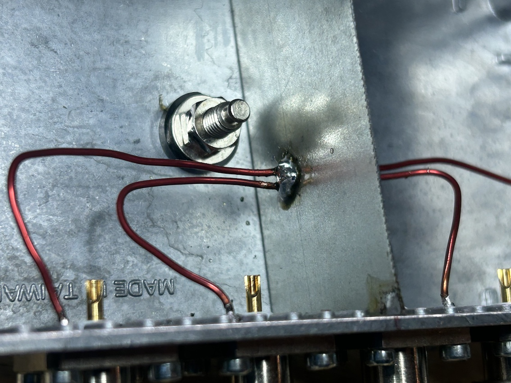
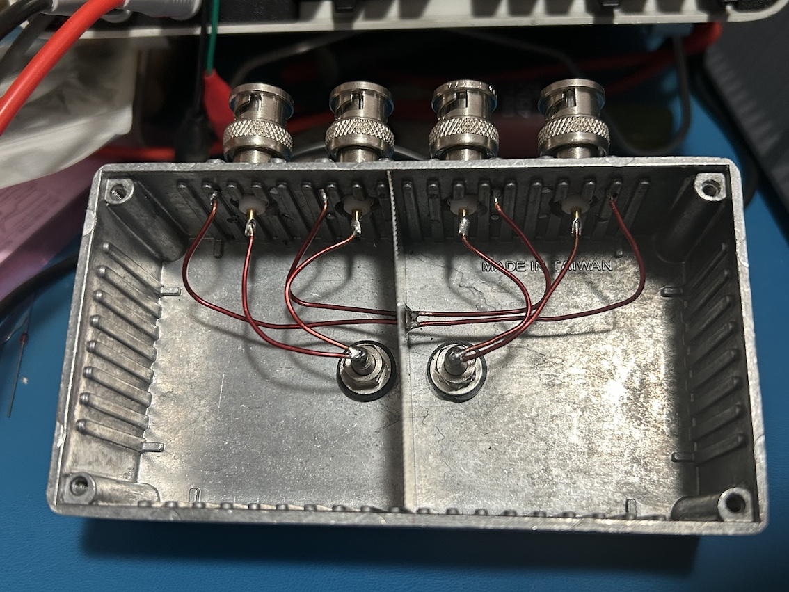
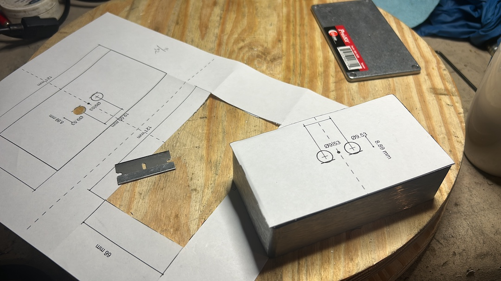
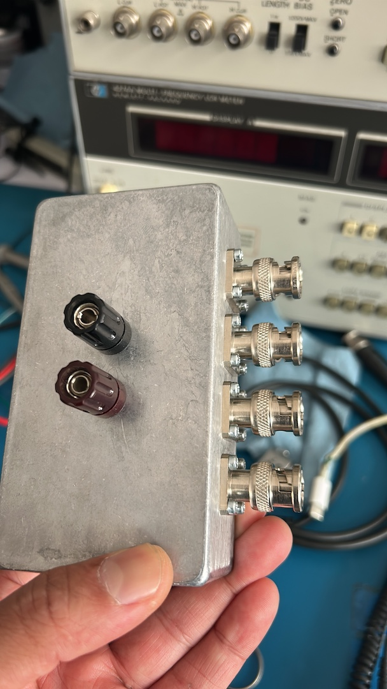

# HP Multi-frequency LCR Adapter

This project provides the documentation and build details for a homebrew interface adapter designed for use with the **HP 4274A**,**HP 4275A** and other Multi-frequency LCR Meters with sane front panel terminal spacing. 

## Zero Cal

# BNC Mount

## Test measurement @10Mhz

## Hardware Overview

## Bill of Materials (BOM)
| Component | Model / Part Number | Description | Quantity |
| :--- | :--- | :--- | :--- |
| **Enclosure** | Pro'sKit 900-162B | Die Cast Aluminum Box | 1 |
| **BNC Connectors** | Pomona Model 2447 & 2447A | BNC (M) Panel Mount Connectors | 4 |
| **Banana Jacks** | Pomona Model 3750, 3760 & 3770 | Standard Binding Posts (Red/Black/Green) | 2  |

Connector Datsheets provided below for reference:
* BNC Binding Port Connectors - [Pomona 3750 Datasheet](binding-post.pdf)
* BNC Connectors - [Pomona 2447A Datasheet](bnc.pdf)

## Fabrication
* BNC Driling Temaplate - [PDF](bnc-drill.pdf)
* BNC Driling Temaplate - [SVG](bnc-drill.svg) 
* Binding Post Driling Temaplate - [svg](banana-drill.svg)

# BNC Drill/Tap

# Grouding/Shield

# Complete Wiring

# Drilling Template

# Final Assembly

Note: svgs are provided in case you want to use a CNC or laser cutter for drilling, while the PDF is for manual drilling reference.

BNC connectors are secured with 4-40 screws, while the binding posts require "D" holes. 

The internal wiring length is kept as short as possible and at the same same length for all the main signal path.

Grouding from each BNC is picked up at the rear of one of the mounting screw, all terminaated at a commoon ground point.

## Tested on 
I specifically tested this adapter with the following HP LCR Meters.
* **HP 4274A:** Multi-frequency LCR Meter (100Hz - 100kHz)
* **HP 4275A:** Multi-frequency LCR Meter (10kHz - 10MHz)
